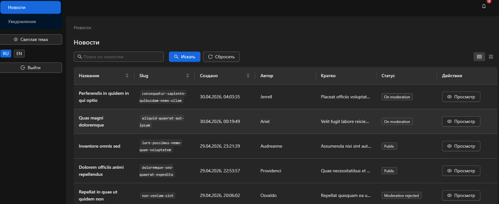
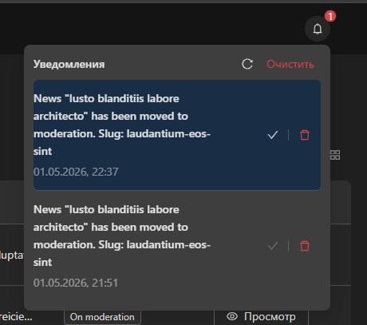
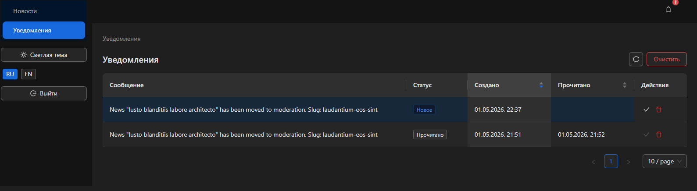

# Frontend

<!-- START doctoc generated TOC please keep comment here to allow auto update -->
<!-- DON'T EDIT THIS SECTION, INSTEAD RE-RUN doctoc TO UPDATE -->

- [English](#english)
  - [Features](#features)
  - [Screenshots](#screenshots)
    - [News List](#news-list)
    - [Notification Bell](#notification-bell)
    - [Notification List](#notification-list)
  - [Development](#development)
  - [Build](#build)
- [Русский](#%D1%80%D1%83%D1%81%D1%81%D0%BA%D0%B8%D0%B9)
  - [Функции](#%D1%84%D1%83%D0%BD%D0%BA%D1%86%D0%B8%D0%B8)
  - [Скриншоты](#%D1%81%D0%BA%D1%80%D0%B8%D0%BD%D1%88%D0%BE%D1%82%D1%8B)
    - [Список новостей](#%D1%81%D0%BF%D0%B8%D1%81%D0%BE%D0%BA-%D0%BD%D0%BE%D0%B2%D0%BE%D1%81%D1%82%D0%B5%D0%B9)
    - [Колокольчик уведомлений](#%D0%BA%D0%BE%D0%BB%D0%BE%D0%BA%D0%BE%D0%BB%D1%8C%D1%87%D0%B8%D0%BA-%D1%83%D0%B2%D0%B5%D0%B4%D0%BE%D0%BC%D0%BB%D0%B5%D0%BD%D0%B8%D0%B9)
    - [Список уведомлений](#%D1%81%D0%BF%D0%B8%D1%81%D0%BE%D0%BA-%D1%83%D0%B2%D0%B5%D0%B4%D0%BE%D0%BC%D0%BB%D0%B5%D0%BD%D0%B8%D0%B9)
  - [Разработка](#%D1%80%D0%B0%D0%B7%D1%80%D0%B0%D0%B1%D0%BE%D1%82%D0%BA%D0%B0)
  - [Сборка](#%D1%81%D0%B1%D0%BE%D1%80%D0%BA%D0%B0)

<!-- END doctoc generated TOC please keep comment here to allow auto update -->

## English

Admin frontend for the Symfony API. The application is built with Next.js, Refine, Ant Design, and a custom API client for authenticated requests.

### Features

- localized routing for Russian and English pages;
- authentication pages for login, registration, and password recovery;
- news listing and detail pages;
- site layout with Ant Design navigation, breadcrumbs, theme support, and a notification bell;
- notification popover with unread count, refresh, mark-as-read, delete, and clear-all actions;
- dedicated notifications page with pagination, sorting, status display, and row actions;
- API client with session refresh support and explicit CSRF handling for mutations;
- unit tests for behavior-sensitive API client logic.

### Screenshots

#### News List



#### Notification Bell



#### Notification List



### Development

Install dependencies before running frontend commands:

```bash
npm install
```

Run the development server:

```bash
npm run dev
```

Run unit tests:

```bash
npm run test
```

Run one unit test file:

```bash
npm run test -- tests/unit/lib/api-client.test.ts
```

Run TypeScript checks without building the frontend:

```bash
./node_modules/.bin/tsc --noEmit
```

### Build

Production build and start scripts are available when needed:

```bash
npm run build
npm run start
```

## Русский

Административный фронт для Symfony API. Приложение собрано на Next.js, Refine, Ant Design и собственном API-клиенте для авторизованных запросов.

### Функции

- локализованный роутинг для русских и английских страниц;
- страницы авторизации, регистрации и восстановления пароля;
- список новостей и страница просмотра новости;
- layout сайта с Ant Design навигацией, хлебными крошками, поддержкой темы и колокольчиком уведомлений;
- всплывающий список уведомлений с количеством непрочитанных, обновлением, отметкой прочитанным, удалением одного уведомления и очисткой всех;
- отдельная страница уведомлений с пагинацией, сортировкой, статусами и действиями по строкам;
- API-клиент с поддержкой обновления сессии и явным управлением CSRF для мутаций;
- unit-тесты для чувствительной к поведению логики API-клиента.

### Скриншоты

#### Список новостей


#### Колокольчик уведомлений


#### Список уведомлений


### Разработка

Перед запуском фронтовых команд установите зависимости:

```bash
npm install
```

Запустить dev-сервер:

```bash
npm run dev
```

Запустить unit-тесты:

```bash
npm run test
```

Запустить один файл unit-тестов:

```bash
npm run test -- tests/unit/lib/api-client.test.ts
```

Проверить TypeScript без сборки фронта:

```bash
./node_modules/.bin/tsc --noEmit
```

### Сборка

Скрипты production-сборки и запуска доступны при необходимости:

```bash
npm run build
npm run start
```
